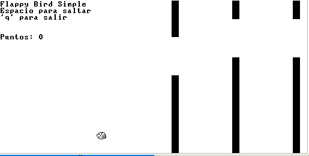

# Flappy Bird - Implementación en Jack para Nand2Tetris

Este proyecto es una implementación del clásico juego Flappy Bird utilizando el lenguaje Jack del curso Nand2Tetris. El juego incluye funcionalidades como el movimiento del pájaro, generación de tuberías con espacios aleatorios, detección de colisiones y un sistema de puntuación.



## 🎮 Características

- Control del pájaro mediante la barra espaciadora
- Animación de alas del pájaro
- Generación de tuberías con espacios aleatorios
- Detección de colisiones
- Sistema de puntuación
- Pantalla de Game Over con puntaje final

## 📋 Requisitos previos

Para ejecutar este juego necesitas:

1. Tener instalado el software de Nand2Tetris (disponible en [nand2tetris.org](https://www.nand2tetris.org/software))
2. JackCompiler para compilar los archivos .jack a .vm
3. VMEmulator para ejecutar los archivos .vm

## 🚀 Instalación y ejecución

### Paso 1: Clonar el repositorio

```bash
git clone https://github.com/nicolas61v/parcialOrganizacion.git
cd parcialOrganizacion
```

### Paso 2: Compilar los archivos Jack

Desde la carpeta del proyecto, ejecuta el compilador de Jack:

```bash
JackCompiler
```

Esto generará los archivos .vm necesarios para cada archivo .jack en el directorio.

### Paso 3: Ejecutar el juego

1. Abre el VMEmulator desde las herramientas de Nand2Tetris
2. Haz clic en "File" > "Load Program"
3. Navega hasta la carpeta del proyecto y selecciónala
4. Haz clic en "Yes" cuando pregunte si deseas cargar todos los archivos VM
5. Configura la velocidad de ejecución (recomendado: "No Animation")
6. Haz clic en el botón "Run" (►) para iniciar el juego

## 🕹️ Controles

- **Barra espaciadora**: Hace que el pájaro salte
- **Q**: Salir del juego

## 📁 Estructura del código

El juego está dividido en varias clases:

- **Main.jack**: Punto de entrada del juego
- **FlappyBirdGame.jack**: Controla la lógica principal del juego, incluido el bucle de juego, la detección de colisiones y el sistema de puntuación
- **FlappyBird.jack**: Maneja la representación y comportamiento del pájaro
- **Pipe.jack**: Implementa la lógica para las tuberías, incluida su generación y movimiento
- **MyMath.jack**: Contiene funciones matemáticas de utilidad

## 🛠️ Implementación técnica

Este proyecto demuestra varios conceptos de programación orientada a objetos en Jack:

1. **Encapsulación**: Cada clase encapsula su propia funcionalidad
2. **Gestión de memoria**: Creación y liberación adecuada de objetos
3. **Gráficos bitmap**: Implementación de sprites para el pájaro
4. **Detección de colisiones**: Algoritmos para detectar cuando el pájaro choca con las tuberías
5. **Entrada de usuario**: Manejo de eventos de teclado

## 🔍 Detalles de implementación

### Sistema de puntuación
- El juego registra un punto cada vez que el pájaro pasa exitosamente por una tubería
- La puntuación actual se muestra en la parte superior izquierda de la pantalla
- Al finalizar el juego se muestra la puntuación total alcanzada

### Generación de tuberías
- Las tuberías se generan con espacios de diferentes alturas
- La dificultad aumenta ligeramente a medida que el juego avanza

## 📝 Notas de desarrollo

Este proyecto fue desarrollado como parte del curso Nand2Tetris para demostrar la capacidad del lenguaje Jack para crear juegos interactivos. La implementación se basa en los conceptos aprendidos durante el curso, desde la creación de compuertas lógicas hasta la programación de alto nivel.

## 🔧 Solución de problemas

- **El juego no compila**: Asegúrate de tener la última versión de las herramientas de Nand2Tetris
- **Pantalla en blanco**: Verifica que todos los archivos .vm estén en la misma carpeta
- **Juego demasiado rápido/lento**: Ajusta la velocidad de ejecución en el VMEmulator

## 🤝 Contribuciones

¡Las contribuciones son bienvenidas! Si deseas mejorar este juego:

1. Haz un fork del repositorio
2. Crea una nueva rama (`git checkout -b feature/amazing-feature`)
3. Realiza tus cambios
4. Haz commit de tus cambios (`git commit -m 'Add some amazing feature'`)
5. Haz push a la rama (`git push origin feature/amazing-feature`)
6. Abre un Pull Request

## 📜 Licencia

Este proyecto está bajo la Licencia MIT - consulta el archivo LICENSE para más detalles.

## ✨ Agradecimientos

- Curso Nand2Tetris por proporcionar las herramientas y conocimientos necesarios
- Dong Nguyen, creador del juego original Flappy Bird
- Al profe Edison porque es quien nos enseño. Gracias

  ## 👨‍💻 Integrantes

- Juan Simón Ospina  
- Sebastián Durán Fernández  
- Santiago Ramírez  
- Nicolás Vásquez

